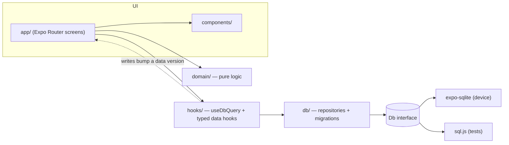

# Expenses

A personal expense tracker for iPhone, built with **Expo (React Native) and TypeScript**.
Log spending the way you would say it — _"285 groceries"_, _"£4.20 coffee yesterday"_ — set
monthly budgets per category, and see where your money goes.

Everything is stored on the device. No account, no server.

## Features

- **Plain-English quick add** — type or dictate `285 groceries`, `spent 12 on lunch with Sam` or
  `50p sweets`. Amount, category, note and date are parsed on-device with a live preview before
  saving.
- **Budgets** — one overall monthly budget, a limit per category, or both. Warnings at 80%, an
  over-budget state, a "£X per day to stay on track" allowance, and a check that the category
  limits fit inside the monthly budget.
- **Insights** — spending by category (donut chart), change versus the same point last month,
  monthly average and a six-month trend with the monthly budget marked (bar chart).
- **Native feel** — iOS tab bar (Liquid Glass on iOS 26+), modal sheets, the native date picker,
  haptics, light and dark mode, and VoiceOver labels throughout.
- **Offline-first** — SQLite on the device with versioned schema migrations.
- **Siri** — "Hey Siri, add groceries to my expenses" → "How much?" → "285", through a native
  Swift App Intent ([native/LogExpenseIntent.swift](native/LogExpenseIntent.swift)).
- **Apple Pay, automatically** — a Wallet automation hands each Apple Pay payment to the app,
  which files it by merchant (Tesco → Groceries, Pret → Eating out) and keeps the shop as the note.

## Tech stack

| Area       | Choice                                                                              |
| ---------- | ----------------------------------------------------------------------------------- |
| App        | Expo SDK 57, React Native 0.86, React 19.2 with the React Compiler                  |
| Language   | TypeScript 6 in strict mode                                                         |
| Navigation | Expo Router (file-based), native tabs and modal screens                             |
| Storage    | `expo-sqlite` with versioned migrations; money stored as integer pence              |
| Charts     | Hand-rolled SVG with `react-native-svg`; the geometry is unit tested                |
| Testing    | Jest (`jest-expo`) + `sql.js`, so repository tests run against a real SQLite engine |
| Quality    | ESLint (`eslint-config-expo`), Prettier and GitHub Actions CI                       |
| Siri       | Swift App Intents compiled into the app target via Expo inline modules              |
| iOS builds | IPA built on a GitHub-hosted Mac, installed with Sideloadly — no Mac needed         |

## Architecture



```
src/
├── app/          Screens and navigation (Expo Router)
├── components/   UI components; ui/ holds the design-system primitives
├── domain/       Pure business logic: money, dates, quick-add parser, budgets, chart geometry
├── db/           Schema, migrations and repositories
├── hooks/        Data hooks built on useDbQuery / useDbMutation
├── state/        App-wide context: selected month, data version
└── test-utils/   In-memory SQLite for tests
```

Key decisions:

- **Money is integer pence.** `0.1 + 0.2 !== 0.3` in floating point; pence never drift.
  Formatting to `£285.50` happens only at the edges.
- **Expenses store a local calendar date** (`2026-09-19`), not a timestamp, so monthly totals
  never shift with time zones or daylight saving.
- **Repositories depend on a small `Db` interface**, not on `expo-sqlite` directly. The
  same SQL runs on the phone and against an in-memory `sql.js` database in Jest.
- **The quick-add parser is pure and exhaustively tested**, because it will also back Siri and
  Shortcuts (see the roadmap).
- **No state library.** Reads go through `useDbQuery`; every write bumps a version in context,
  and queries re-run. It is small, explicit and enough for a single-user, on-device app.

## Getting started

You need Node.js 22+ and the free **Expo Go** app on your iPhone. No Mac is required.

```bash
npm install
npm start
```

Scan the QR code with the iPhone Camera app to open the project in Expo Go. The phone and the
computer must be on the same Wi-Fi network; if they cannot see each other, run
`npx expo start --tunnel` instead.

In development builds, the empty Overview screen offers **Load sample data**, which fills six
months of realistic expenses and budgets so the charts have something to show.

### Scripts

| Command             | What it does                                             |
| ------------------- | -------------------------------------------------------- |
| `npm start`         | Start the dev server (open in Expo Go)                   |
| `npm test`          | Run the Jest suite                                       |
| `npm run typecheck` | Type-check with `tsc`                                    |
| `npm run lint`      | Lint with ESLint                                         |
| `npm run format`    | Format with Prettier                                     |
| `npm run check`     | Type-check, lint, check formatting and test — same as CI |

## Installing on an iPhone

Siri needs a real build rather than Expo Go. [docs/install-on-iphone.md](docs/install-on-iphone.md)
builds one on a GitHub-hosted Mac and installs it with a free Apple ID through Sideloadly.

## Roadmap

- [x] **Siri** — "Hey Siri, add groceries to my expenses" → "How much?" → "285".
- [x] **Apple Pay** — payments added automatically through a Wallet transaction automation.
- [ ] **Siri in one sentence** — "Hey Siri, add £285 to my Groceries list in Expenses", using the
      iOS 27 Reminders schema (needs Expo SDK 58 and Xcode 27).
- [ ] **Action Button and Back Tap** — one press, say "285 groceries", done.
- [ ] Shortcuts deep link: `expenses://expense/new?text=285%20groceries` already pre-fills the
      form.
- [ ] Custom categories, CSV export and receipt photos.
- [ ] TestFlight release.
